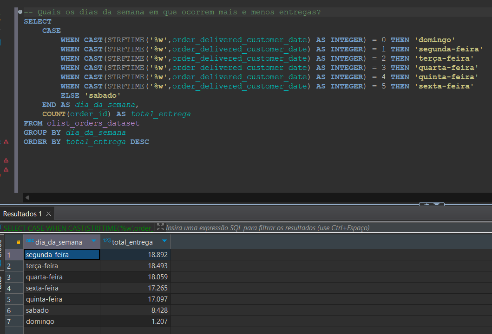

# Analisando Dados de Vendas com SQL - Uma Abordagem Direta com SQLite e Dbeaver  
## Objetivo e Resumo do Projeto
Essa é uma análise de dados de vendas da Olist Store. Nela foi elaborada algumas possíveis perguntas de negócios com o objetivo de obter insights sobre os dados e demonstrar minhas habilidades utilizando o SQL. A partir desta análise, foi possível reconhecer os padrões de vendas, entregas e KPIs por exemplo. O projeto completo pode ser encontrado em [meu artigo no Medium.](https://medium.com/@gleicearaujo638/analisando-dados-de-vendas-15d780d10be5) 

### Perguntas de Negócios 
Para ajudar a responder as perguntas de negócios, o SQL foi a única ferramenta utilizada neste primeiro momento. O SQL (Structured Query Language) é a linguagem padrão para lidar com bancos de dados e o conhecimento de algumas de suas principais funções é o que possibilita obter informações de grandes volumes de dados. Para essa análise foram elaboradas 22 perguntas, são elas:   

    1. Qual a quantidade de vendedores distintos cadastrados?
    2. Qual a quantidade de cidades e Estados distintos cadastrados?
    3. Quais cidades possuem mais vendedores?
    5. Quais Estados possuem mais vendedores?
    5. Qual o Porcentual de vendedores por Estado?
    7. Quantos clientes existem?
    8. Quantas são as cidades e Estados distintos?
    9. Quais cidades e Estados possuem mais clientes?
    10. Qual o percentual de clientes por Estado? 
    11. Qual o tempo médio de entrega da transportadora?
    12. Qual o tempo médio de postagem de um produto a partir do pagamento aprovado?
    13. Qual a taxa de acurácia de entregas? 
    14. Quais os status de encomenda e sua porcentagem de participação em relação ao total de pedidos?
    15. Quais os dias da semana ocorrem mais e menos entregas?
    16. Quais os dias da semana ocorrem mais e menos compras? 
    17. Qual é a receita total de vendas?
    18. Qual o valor total de frete?
    19. Qual foi a receita por ano?
    20. Qual foi a receita por mês?
    21. Qual o ticket médio de vendas?
    22. Qual o ticket médio por vendedor?  

### Queries

Qual a taxa de acurácia de entregas?  

     

Quais os dias da semana ocorrem mais e menos compras?  

 

Quais os dias da semana ocorrem mais e menos entregas?  

 

Qual o ticket médio de vendas? (base)

  

Qual o ticket médio por vendedor?

 

  Para ajudar a explorar os dados e a responder a essas perguntas, os principais comandos e funções do SQL utilizadas foram: 

+ **SELECT** - Usado para consultar e recuperar dados de uma tabela em um banco de dados.
+ **WHERE** - Usado para filtrar registros que atendem a uma condição específica.
+ **SUM()** - A função foi usada para calcular a soma total de um conjunto de valores.
+ **AVG()** - Usada para calcular a média de um conjunto de valores.
+ **CASE WHEN** - A expressão CASE é usada para criar condições condicionais, similar a uma instrução if-else em linguagens de programação.
+ **JULIANDAY()** - A função é bastante útil para cálculos com datas.
+ **CTE (Common Table Expressions)** - Foi bastante útil e prática para elaboração de tabelas temporárias. Para elaborá-las é necessário o uso do comando **WITH**.
+ **JOIN** - Usado para combinar os registros entre tabelas.

Além desses comandos e funções foram usados outros igualmente importantes para realização desta análise. 

## Fonte de Dados 
Os dados utilizados foram retirados do Kaggle, o nome do dataset é [Brazilian E-Commerce Public Dataset by Olist](https://www.kaggle.com/datasets/olistbr/brazilian-ecommerce) e está disponível no link. 
O dataset da Olist possui no total 8 tabelas e o schema pode ser visto abaixo:   

 

## Ferramentas Utilizadas
Para este projeto foi utilizado o **SQLITE** como banco de dados e o **DBEAVER** para gerenciamento do banco. Saiba mais sobre download e documentação desses programas nos links abaixo. 
* [Download SQLITE](https://www.sqlite.org/) e [SQLITE documentação](https://www.sqlite.org/docs.html)
* [Download Dbeaver](https://dbeaver.io/download/) e [Dbeaver documentação](https://dbeaver.com/docs/dbeaver/)

O Dbeaver é um software multiplataforma, e com ele é possível utilizar diversos bancos de dados de forma prática.   

   

## Veja Análise Completa 

 + [Projeto Completo](https://medium.com/@gleicearaujo638/analisando-dados-de-vendas-15d780d10be5) 

## Meus Contatos

 + [LinkedIn](https://www.linkedin.com/in/gleicearaujo/) 
  
 + [Gmail](gleicearaujo638@gmail.com) 
 

  

